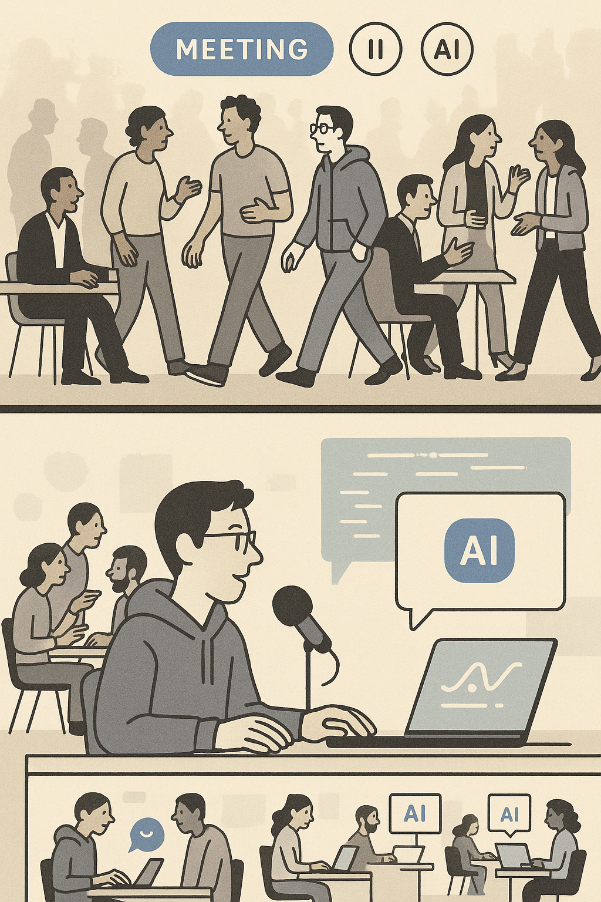

A striking pattern has emerged across technical organizations: CTOs are building again. For the first time in years, senior technical leaders are returning to hands-on development work—not as a distraction from strategic responsibilities, but as a direct amplification of them.

This shift represents more than individual productivity gains. GitHub's comprehensive research study reveals the scope of this transformation: developers using AI coding assistants complete tasks 55% faster than those without. In a controlled study with 95 developers, those using GitHub Copilot finished an HTTP server implementation in an average of 1 hour and 11 minutes, while the control group required 2 hours and 41 minutes—a statistically significant result with 95% confidence.

But the deeper story isn't about speed. It's about how AI has fundamentally altered the leverage equation for technical leadership, challenging basic assumptions about how teams scale and create value.

## The Traditional Scaling Trap

For decades, technical leaders faced a stark choice. To increase their impact, they needed to scale through people—hire more engineers, build larger teams, create more complex organizational structures. This traditional path came with inevitable trade-offs.

Every additional engineer hired reduces a leader's personal technical velocity. Leaders become coordinators instead of creators, shifting their value from solving problems to managing people who solve problems. Larger teams mean more meetings, more coordination, more politics. Technical leaders find themselves increasingly distant from the code that powers their companies.

Research from Harvard Business School confirms this overhead: communication costs in software teams grow exponentially with team size, creating what researchers call "process loss"—productivity that disappears into coordination rather than creation.

The COVID-19 pandemic made these trade-offs impossible to ignore. As companies went remote, the communication overhead of large teams became a visible bottleneck in architectural decisions and feature development.

## The AI Leverage Revolution

Generative AI has shattered this paradigm. Tools like GitHub Copilot, ChatGPT, and Claude can produce sophisticated code from natural language descriptions. For experienced technical leaders, this isn't just about faster coding—it's about restored personal leverage.

Unlike junior developers who still need to understand and debug AI-generated code, experienced engineers can leverage AI to implement ideas they already understand architecturally, amplifying their expertise rather than replacing it.

Technical leaders describe AI coding tools as equivalent to having a team of junior developers with perfect memory and infinite patience. They can prototype complex systems in hours instead of weeks, experiment with technologies they're not experts in, and explore creative possibilities that were previously too time-intensive.

## Return to Deep Work

The concept of intense, highly productive coding sessions has become increasingly common among technical leaders. CTOs and VPs of Engineering across Silicon Valley report returning to these deep work states for the first time in years.

Industry reports indicate that technical leaders are blocking out dedicated coding time and achieving remarkable results. One documented case involved a CTO building and deploying a complete admin dashboard in a single day—work that design teams had been requesting for months.

This personal productivity revival is reshaping how technical leaders think about their roles. Instead of primarily managing others, they're becoming "force multipliers"—individuals who can personally deliver significant value while still providing strategic direction.

The psychological impact proves profound. Many leaders report remembering why they became engineers in the first place: the immediate feedback, the creative problem-solving, the satisfaction of building something that works. AI tools have restored this experience without sacrificing the strategic oversight that comes with senior roles.

## The Orchestration Challenge and Garden Principle

However, this transformation in individual capability creates entirely new organizational challenges. As AI-powered productivity makes individual contributors more capable, the fundamental question shifts from "how do we build this?" to "how do we decide what to build?"

Research on organizational behavior reveals what experts call "the orchestration problem"—when everyone can build anything quickly, coordination becomes the bottleneck. Teams can generate so many possibilities that decision-making becomes paralyzing.

This dynamic is forcing companies to rethink optimal team sizes. With AI amplification, larger teams can generate unmanageable complexity—what technical leaders describe using a practical analogy: you can't scale a garden by adding more gardeners indefinitely. At some point, they start stepping on each other's plants. AI makes each gardener incredibly productive, but it also makes overcrowding problems apparent much faster.

*The transformation of technical leadership: from coordinating large teams to orchestrating AI-augmented individuals.*

QSM studies conclude that 3-7 people is the optimum team size, with smaller teams completing projects with significantly higher productivity than larger teams. Teams now organize around what industry leaders call "complexity boundaries"—each team handles problems that can fit within the cognitive capacity of 4-6 AI-assisted engineers.

Some companies are downsizing core platform teams, with smaller teams shipping faster because they can actually coordinate their AI-assisted work. The garden principle applies: optimal productivity requires intentional boundaries rather than unlimited expansion.

## Strategic Implications and Early Adopters

This shift has profound implications for technical leadership. CTOs who embrace AI-assisted personal productivity are discovering they can directly influence technical outcomes while maintaining strategic oversight. They're becoming "hands-on visionaries" rather than pure managers.

Modern technical roles now combine strategist, architect, and implementer responsibilities. Leaders can validate technical approaches by building proof-of-concepts themselves, unblock teams by diving into critical technical problems, and prototype new features to test product hypotheses.

Companies are adapting their practices accordingly. Organizations are updating their technical interview processes to assess candidates' ability to work effectively with AI coding assistants, expecting them to solve challenges that require genuine engineering judgment even with AI assistance.

Recent surveys support these observations. According to SoftBank Vision Fund's 2024 CTO survey, CTOs doubled AI budgets with coding copilots as the top use case, reflecting the strategic priority leaders place on AI-augmented development capabilities.

## The Leverage Paradox

Perhaps the most striking aspect of this trend is how it inverts conventional wisdom about organizational scaling. Instead of achieving leverage through managing larger teams, technical leaders are discovering more effective leverage through AI-augmented personal productivity.

As one industry leader observed, "Generative AI is managerial leverage without managerial overhead. You get the productivity multiplication of a large team without the communication costs, politics, or coordination challenges."

This shift represents a return to the entrepreneurial roots of technology leadership. Before companies grew large enough to require complex organizational structures, technical founders succeeded through personal productivity and direct problem-solving. AI tools are enabling that approach at modern scale.

## The Future of Technical Leadership

The transformation we're witnessing represents more than a productivity boost—it's a fundamental redefinition of what technical leadership means. The most successful CTOs of the next decade will be those who master the balance between personal technical contribution and organizational leadership, orchestrating both human intelligence and artificial intelligence while building structures that can coordinate AI-assisted teams effectively.

We're entering an era where technical leaders can maintain their connection to the craft while scaling their impact. The age of the pure technical manager is ending. The age of the AI-assisted technical leader—one who builds, guides, and amplifies simultaneously—has begun.

For technical leaders wondering whether this shift applies to them, the question isn't whether AI will change their role, but whether they'll actively shape that change or passively adapt to decisions made by others. The leaders writing code today are writing the playbook for technical leadership tomorrow.

---

## References

[1] GitHub Next. "Research: quantifying GitHub Copilot's impact on developer productivity and happiness." GitHub Blog. https://github.blog/news-insights/research/research-quantifying-github-copilots-impact-on-developer-productivity-and-happiness/

[2] Peng, Sida, et al. "The Impact of AI on Developer Productivity: Evidence from GitHub Copilot." arXiv preprint arXiv:2302.06590 (2023). https://arxiv.org/abs/2302.06590

[3] IBM. "What is AI Orchestration?" IBM Think Topics. https://www.ibm.com/think/topics/ai-orchestration

[4] QSM. "Team Size Can Be the Key to a Successful Software Project." https://www.qsm.com/team-size-can-be-key-successful-software-project

[5] SoftBank Vision Fund. "CTO Survey 2024: AI Budgets Double, Coding Copilots Lead Use Cases." https://visionfund.com/survey/cto-survey-2024-q3