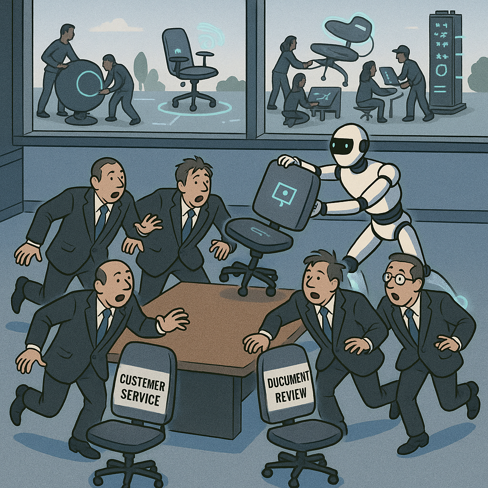

## The Beautiful Irony

Salesforce isn't hiring engineers this year. Their big AI play? AgentForce—helping companies do the same things with fewer people.

Here's a company that claims to embrace the "agentic future" and "radical AI transformation." But their most ambitious vision? "With all the time saved, your customer service agents can focus on the hard cases."

That's it. That's the ceiling. Not "turn every employee into a superpower." Not "unlock capabilities you never had." Just... shuffle the existing work around more efficiently.

They're using the language of transformation while executing an efficiency play. Classic incumbent theater.

Twenty years ago, Salesforce sold actual transformation: "No Software!" Today, they sell musical chairs: "No People!" From revolutionizing how companies operate to optimizing call center schedules. This is what "embracing AI" looks like with a legacy mindset.

The rejected CS grads, laid-off juniors, and unconverted interns? They're not building Salesforce killers—network effects are real, and enterprises don't rip out CRM systems lightly. But they ARE building the weird experiments, the toys that become tomorrow's categories, the form factors that incumbent execs can't even imagine.

Salesforce will be fine. Legacy companies can print money for decades—Microsoft did it for years before Satya arrived to slaughter the sacred cows. But there's a difference between being profitable and being vital. Between surviving and shaping the future.

When your AI strategy is headcount reduction dressed up as transformation, you've already told the world which one you've chosen.

*The reality behind "AI transformation" rhetoric: automation taking seats while human potential gets sidelined.*

## The Pattern Across Industries

The Salesforce story isn't unique—it's epidemic. Across every major industry, incumbents are deploying transformation rhetoric to mask optimization plays. The gap between AI marketing speak and actual capability expansion reveals which companies are building for the future versus managing decline.

### Finance: Smart Automation, Not Smart Banking

JPMorgan Chase's AI narrative sounds revolutionary: "We're transforming banking with artificial intelligence, democratizing access to financial services, and reimagining customer relationships." Their actual deployment? COiN (Contract Intelligence), which reads legal documents faster than junior lawyers.

That's not transformation—that's document processing with better marketing. The same loan approvals, the same risk models, the same account management workflows. Just faster, cheaper, and with fewer people reading contracts.

Meanwhile, their "AI-powered" wealth management recommendations still funnel clients toward the same high-fee products that maximize bank revenue. The AI isn't expanding what's possible for customers; it's optimizing how quickly the bank can route them to profitable products.

Compare this to what actual transformation might look like: real-time credit decisions based on income volatility rather than static scores, personalized financial education that adapts to spending patterns, or investment products that dynamically rebalance based on life changes. These would require new capabilities, new risk frameworks, new ways of thinking about customer relationships.

But JPMorgan isn't building new capabilities. They're applying AI to make existing processes more efficient. When your AI strategy preserves every existing business model assumption, you're doing optimization theater.

### Healthcare: Diagnostic Theater vs. Care Revolution

In healthcare, the transformation rhetoric reaches fever pitch. "AI-powered diagnostics will revolutionize patient care!" "Machine learning is transforming medicine!" "We're entering the age of precision healthcare!"

Look at the actual deployments. Radiologists using AI to spot anomalies in X-rays faster. Insurance companies using machine learning to process claims more efficiently. Electronic health records with "smart" autocomplete for diagnosis codes.

These aren't transformation—they're pattern recognition applied to existing workflows. The same doctors make the same decisions based on the same protocols. The same insurance gatekeepers deny the same claims with better algorithms. The same bureaucratic overhead, just optimized.

Real healthcare transformation would require fundamentally different approaches: continuous biometric monitoring that catches problems before symptoms appear, personalized treatment protocols based on genetic profiles and lifestyle data, or AI that identifies entirely new therapeutic targets. These would require new care models, new relationships between patients and providers, new ways of thinking about health maintenance versus disease treatment.

Instead, most healthcare AI focuses on making the current broken system run more efficiently. When your AI strategy doesn't question why radiologists need to look at thousands of images per day or why insurance approval takes weeks, you're optimizing the wrong thing.

### Manufacturing: Smart Factories, Same Thinking

Manufacturing executives love talking about "Industry 4.0" and "smart factories powered by AI." The reality? Sensor-equipped production lines that optimize yields and predict equipment failures.

That's predictive maintenance with better sensors, not manufacturing transformation. The same assembly line thinking, the same batch production logic, the same centralized factory model. Just with more data and fewer unexpected breakdowns.

Boeing's 787 production line uses extensive AI for quality control and efficiency optimization. It's still one of the most delayed, over-budget aircraft programs in history because the fundamental approach—outsourcing critical components to suppliers worldwide and assembling them in a traditional factory—remains unchanged.

Real manufacturing transformation might look like: fully distributed production networks that shift based on demand patterns, mass customization that approaches one-off economics, or AI-designed products that optimize for entirely new performance criteria. These would require new supply chain models, new manufacturing processes, new relationships with customers.

But most "smart manufacturing" AI is applied to making existing factories run better, not questioning whether factories are the right model for future production.

*The efficiency trap: AI making existing processes faster without questioning whether they're the right processes.*

*AI transformation requires questioning fundamental assumptions—not just applying robots to existing processes.*

## The Framework: Five Questions That Reveal Theater

After analyzing transformation claims across dozens of companies, patterns emerge. The difference between AI theater and real transformation comes down to five critical questions:

### 1. Does the AI expand capabilities or optimize existing ones?

Transformation creates new possibilities. Theater makes current processes faster or cheaper.

**Theater:** "Our AI chatbot handles 80% of customer service inquiries without human intervention."
**Transformation:** "Our AI identifies customer needs they didn't know they had and creates solutions that didn't exist before."

### 2. Do new business models become possible, or do existing models become more efficient?

Transformation enables revenue from sources that were previously impossible. Theater maximizes revenue from existing sources.

**Theater:** "AI helps us cross-sell more effectively to our customer base."
**Transformation:** "AI enables business models we couldn't attempt before—subscription-based jet engines, outcome-based insurance, or personalized education that adapts in real-time."

### 3. Does implementation require questioning fundamental assumptions about how the business operates?

Transformation forces you to revisit core beliefs about customers, markets, and value creation. Theater takes current assumptions as given.

**Theater:** "We use AI to better predict which customers will churn so we can retain them more effectively."
**Transformation:** "We use AI to understand why customers actually choose us, revealing that our entire market segmentation was wrong and leading us to restructure around different value propositions."

### 4. Do competitive advantages shift to new dimensions, or get reinforced on existing ones?

Transformation changes the basis of competition. Theater strengthens current competitive positions.

**Theater:** "Our AI makes our existing supply chain advantages even stronger."
**Transformation:** "AI eliminates the importance of traditional supply chains, making distributed production and mass customization viable for the first time."

### 5. Do employees gain new superpowers, or become more efficient at current tasks?

Transformation amplifies human capability in new directions. Theater makes humans more productive at existing work.

**Theater:** "With AI handling routine tasks, our employees can focus on higher-value activities within their current roles."
**Transformation:** "AI enables our marketing team to become product designers, our customer service reps to become consultants, and our accountants to become strategic advisors."

*Real transformation: bridging human creativity with AI capabilities to unlock entirely new possibilities.*

## What Real Transformation Actually Looks Like

The framework reveals why transformation is so rare—it requires abandoning profitable certainties for uncertain possibilities. But some companies are actually doing it.

### Tesla: Manufacturing Transformation

While traditional automakers use AI to optimize existing assembly lines, Tesla rebuilt manufacturing from first principles. Their AI doesn't just predict equipment failures—it continuously redesigns production processes.

The Shanghai Gigafactory uses machine learning to optimize not just efficiency, but the fundamental approach to automotive manufacturing. The production line incorporates vertical lifts and dynamic configurations that adapt based on demand patterns. Quality control AI identifies design improvements that get fed back to engineers in real-time.

This isn't just faster car production—it's a different model where manufacturing and design become continuous, interconnected processes rather than sequential phases.

### Stripe: Financial Infrastructure Transformation

While banks use AI to optimize existing payment processing, Stripe used machine learning to create entirely new financial infrastructure. Their fraud detection doesn't just flag suspicious transactions—it enables new business models.

Companies can now launch global marketplaces, subscription services, or complex multi-party payment systems that would have been impossible without Stripe's AI-powered infrastructure. The transformation isn't faster payments—it's making complex financial interactions accessible to any developer.

### Netflix: Content Optimization Revolution

Traditional media companies use AI to optimize advertising placement and content recommendation. Netflix uses machine learning to transform multiple aspects of content operations—from production budget optimization to personalized thumbnail selection to advanced visual effects automation.

Their AI infrastructure processes viewing patterns across 260+ million subscribers to guide not just what shows to recommend, but how to optimize production costs, which international markets to target, and how to personalize visual presentation for different audience segments.

The transformation isn't more efficient content distribution—it's data-driven content operations that optimize the entire pipeline from production to consumption.

*From simple automation to strategic transformation: AI's evolution from basic tools to capability multipliers.*

## The Competitive Implications

Companies that choose optimization over transformation aren't just missing opportunities—they're accumulating strategic debt. Efficiency gains compound slowly; capability expansion compounds exponentially.

### The Innovation Tax

Every quarter spent on optimization instead of capability expansion represents an innovation tax—the future opportunity cost of present efficiency. This tax compounds because transformation requires time to develop new skills, relationships, and market positions.

Salesforce's AgentForce might reduce customer service costs by 20%. But while they're optimizing call centers, startups are building AI that makes traditional customer service obsolete—conversational interfaces that resolve issues before customers know they exist, or product designs that eliminate most support needs entirely.

The efficiency gains are real and immediate. The opportunity cost is hidden and exponential.

### The Incumbent's Dilemma

Incumbents face a cruel choice: optimize profitable existing businesses or cannibalize them for uncertain futures. Shareholders reward predictable efficiency gains; transformation requires patient capital and tolerance for failure.

This creates a systematic bias toward theater. Announcing "AI transformation" satisfies stakeholder expectations while optimizing existing operations satisfies quarterly metrics. The gap between rhetoric and reality can persist for years.

But markets eventually punish the gap. Companies that consistently choose efficiency over capability expansion find themselves competing on increasingly commoditized dimensions against new entrants with fundamentally different cost structures and value propositions.

### Historical Parallels

We've seen this pattern before. During the internet transition, incumbents used "digital transformation" rhetoric while implementing e-commerce overlays on existing operations. Online catalogs instead of digital-native experiences. Email marketing instead of community-driven growth.

The winners weren't companies that digitized existing processes faster—they were companies that used digital capabilities to create entirely new business models. Amazon didn't just sell books online more efficiently; they reimagined retail as a logistics and data platform. Google didn't just digitize yellow pages; they turned search into an attention marketplace.

The AI transition follows the same pattern. Companies that use AI to optimize existing operations will survive and may thrive for years. But companies that use AI to expand into new capabilities will define the next competitive landscape.

## Evaluation Signals: Reading Between the Lines

Distinguishing transformation from theater requires looking beyond public statements to operational signals. Language patterns, investment decisions, and organizational changes reveal strategic intent.

### Language Patterns That Reveal Theater

**Theater Language:**
- "AI-powered" + existing product names
- "Efficiency," "optimization," "automation" as primary benefits
- ROI calculations based on headcount reduction
- "Focus on higher-value activities" without defining what those are
- Success metrics tied to cost savings rather than new revenue sources

**Transformation Language:**
- New product categories that didn't exist before
- Revenue from sources that were previously impossible
- Customer relationships that work differently than before
- Success metrics based on capability expansion
- "We can now do X, which we never could before"

### Investment Pattern Analysis

**Theater Investments:**
- AI applied to existing departments without changing reporting structures
- Technology spending focused on vendor solutions for specific processes
- Innovation budgets as separate line items divorced from core operations
- R&D spending that decreases as a percentage of revenue

**Transformation Investments:**
- New organizational structures that cross traditional department boundaries
- In-house AI development capabilities rather than just vendor implementations
- Innovation spending integrated into core business operations
- R&D spending that increases as AI capabilities expand

### Organizational Structure Clues

**Theater Organizations:**
- AI initiatives owned by IT departments or innovation labs
- Existing business unit structures unchanged
- "Digital transformation" teams that operate separately from core business
- Success measured by process improvements within current functions

**Transformation Organizations:**
- AI capabilities distributed across business functions
- New roles that combine previously separate functions
- Cross-functional teams with P&L responsibility for new AI-enabled products
- Success measured by new market creation and customer value expansion

## Choosing Your Path

The choice between optimization and transformation isn't moral—it's strategic. Both approaches can create value, but they lead to fundamentally different competitive positions.

### When Optimization Makes Sense

For companies in stable markets with strong competitive moats, optimization can extend dominance for decades. Microsoft's pre-Satya era demonstrated how efficiency focus can maintain profitability even while missing major platform shifts.

Optimization makes strategic sense when:
- Core business models remain structurally defensible
- Customer switching costs are high and growing
- Market growth is limited, making efficiency gains directly translatable to market share
- Regulatory environments favor incumbents over new entrants

### When Transformation Becomes Imperative

Transformation becomes necessary when industry boundaries blur, customer expectations shift, or new technologies enable previously impossible business models.

Transformation indicators include:
- New entrants targeting customer jobs rather than existing solutions
- Platform technologies that enable entirely new value creation models
- Customer behavior changes that make existing assumptions obsolete
- Regulatory changes that level playing fields between incumbents and challengers

### The Hybrid Approach

The most sophisticated companies pursue both simultaneously—using optimization gains to fund transformation experiments. Amazon's approach exemplifies this: relentless operational efficiency in existing businesses funds ambitious bets on new capabilities.

This requires organizational ambidexterity: protecting and optimizing core businesses while building entirely new capabilities that may eventually cannibalize them.

## The Future Belongs to Capability Expanders

AI represents the most significant capability expansion opportunity since the internet. Companies that use it primarily for optimization will find themselves competing on increasingly commoditized dimensions against new entrants with fundamentally different advantages.

The future competitive landscape will be defined by companies that used AI to expand what's possible, not just to do existing things better. The choice between efficiency and capability expansion isn't just about short-term performance—it's about whether your company shapes the future or adapts to one shaped by others.

The Salesforce story isn't a criticism—it's a diagnostic. When your AI strategy focuses on headcount reduction instead of capability expansion, you've revealed which future you're building toward.

The question isn't whether AI will transform your industry. The question is whether your company will lead that transformation or be transformed by it.

In a world where AI makes the impossible possible, the biggest risk isn't moving too fast—it's mistaking efficiency for transformation and optimizing your way to irrelevance.

The companies that emerge as AI-era leaders will be those that looked at their AI capabilities and asked not "How can this make us more efficient?" but "What can we do now that we never could before?"

That's the difference between AI theater and real transformation. And that difference will determine who owns the next decade of competitive advantage.