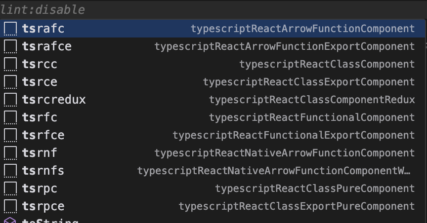

## The Initial Learning Curve

Adopting AI tools like Cursor, Copilot, and GPT-4 was pretty easy since I was already used to VSCode and GitHub Copilot. Moving to the new stack flipped a switch in my mind, prompting me to find more ways to leverage AI. It took me about two months to truly grasp how to extract the full potential of these tools.

After roughly a month of writing code with these AI tools, a noticeable shift occurred. I started investing more time in explaining my intentions to the AI. Instead of quickly jumping to snippet shortcuts like `tsrafc`, advanced vim commands or just typing furiousl, I got in the habit of stepping back and assessing how well the AI would accomplish the same idea. I learned to invest the time to explain my thoughts, and frankly how to do it effectively. The more I practiced this, the better I understood the AI's strengths and where I was better just doing the work.

Recently, I've been able to ship complete feature ideas in just a few hours, with a level of joy and quality I never expected. This is so much fun!

## Enhanced Code Quality

AI tools can significantly improve code quality by catching errors and suggesting optimizations that might be overlooked in manual coding. My mental energy level has peaks and valleys and sometimes, asking GPT what it would do to improve a specific function can get me 80% of the way towards a solid refactor. The part that super cool about my new workflow is that I can easily include narrow context (highlighting the code I want to talk about) as well as global context (my whole codebase).

## Time Savings and Efficiency

The time savings achieved with AI tools are quantifiable. I can refactor modules, add key new functionality in less than an hour. I was recently working on an "AI managed code" idea and that got me going even further the code generation path and I noticed within the same project the change in efficiency.

##Creativity and Innovation

For me, lowering the friction to execute on an idea is a real game changer. I have a ton of ideas that honestly would be a bit of a pain to ship at my normal pace. Now, I can feel a difference. It's quite remarkable.

## Conclusion

I think there's only so much you can learn about this workflow by reading. You have to feel it. I recommend my exact workflow to get started. If you're a developer and still hand typing all your code, you're going to have a rough decade imo. And if you're a technical manager who hasn't shipped code in years, all I can say is gg mate, gg.
